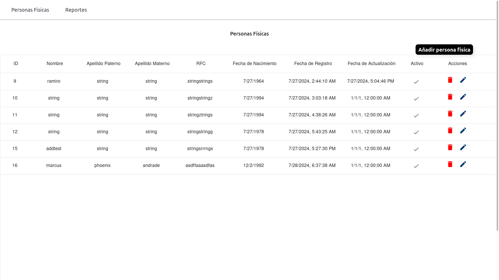
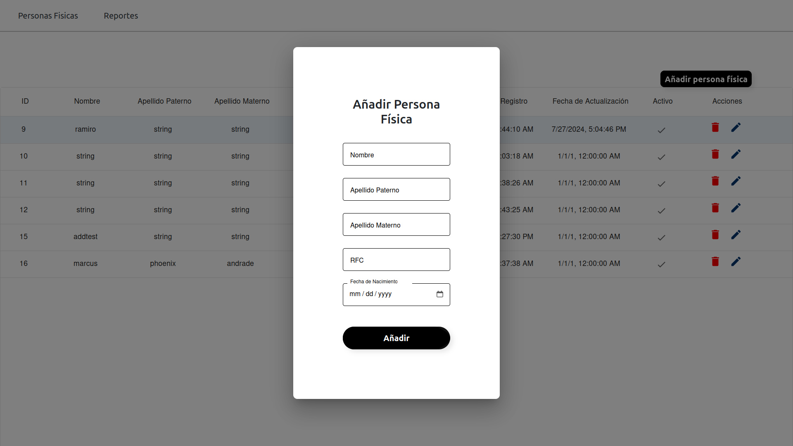
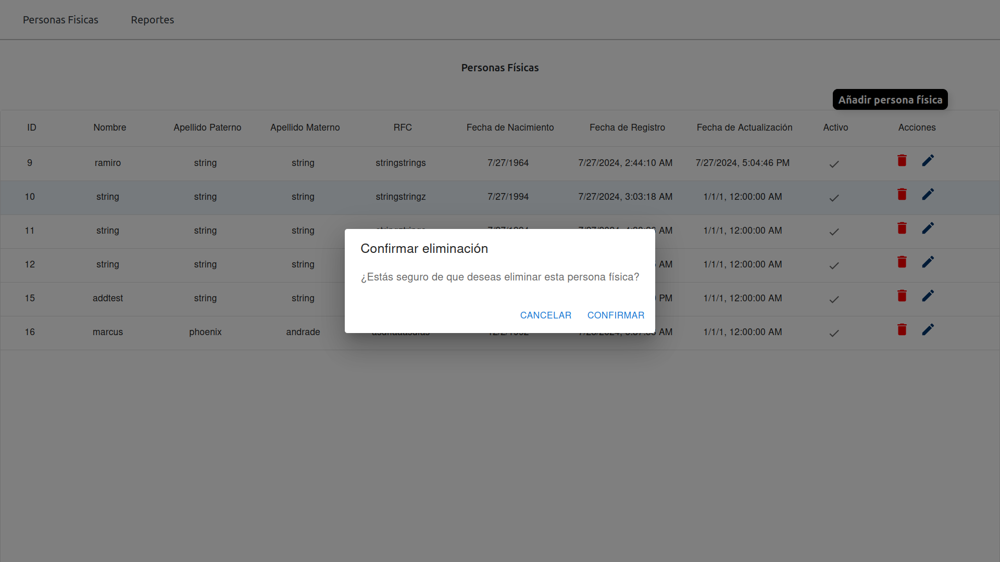

# Personas Físicas App

## Descripción

Aplicación de prueba web hecha con React y Vite. Utiliza TypeScript junto con varias bibliotecas populares como MUI para componentes de interfaz de usuario, Redux Toolkit para la gestión del estado y Axios para las solicitudes HTTP.

Esta aplicación se encuentra conectada a un API desarrollado por mi en .NET Core 8.0.

## Capturas de pantalla

**Inicio de sesión**

**Pantalla de personas físicas**

**Añadir persona física**

**Eliminar persona física**

**Actualizar persona física**

## Configuración del Entorno

### Variables de Entorno

Asegure de tener un archivo `.env` en la raíz del proyecto con las siguientes variables:

**env**
VITE_AUTH_URL=https://api.toka.com.mx/candidato/api/login/authenticate
VITE_API_PERSONAS_FISICAS_URL="http://localhost:5192"

## Instalacion

Clone el repositorio 

  git clone https://github.com/emmanuel-perez/Toka-App.git

### Instalacion de dependencias

  yarn

## Scripts disponibles

* npm run dev: Inicia el servidor de desarrollo de Vite.
* npm run build: Compila el proyecto con TypeScript y luego construye la aplicación para producción con Vite.
* npm run lint: Ejecuta ESLint para analizar el código y asegurar que sigue las convenciones definidas.
* npm run preview: Previsualiza la aplicación de producción localmente.

## Dependencias

### Producción

    @emotion/react: ^11.13.0
    @emotion/styled: ^11.13.0
    @mui/icons-material: ^5.16.5
    @mui/material: ^5.16.5
    @mui/x-data-grid: ^7.11.1
    @reduxjs/toolkit: ^2.2.7
    axios: ^1.7.2
    react: ^18.3.1
    react-dom: ^18.3.1
    react-redux: ^9.1.2
    react-router-dom: ^6.25.1

### Desarrollo

    @types/node-sass: ^4.11.7
    @types/react: ^18.3.3
    @types/react-dom: ^18.3.0
    @typescript-eslint/eslint-plugin: ^7.15.0
    @typescript-eslint/parser: ^7.15.0
    @vitejs/plugin-react-swc: ^3.5.0
    eslint: ^8.57.0
    eslint-plugin-react-hooks: ^4.6.2
    eslint-plugin-react-refresh: ^0.4.7
    node-sass: ^9.0.0
    sass: ^1.77.8
    typescript: ^5.2.2
    vite: ^5.3.4

##  Escructura del proyecto
src/
├── api/                # Solicitudes API y configuración
├── assets/             # Imágenes, fuentes y otros recursos estáticos
├── components/         # Componentes reutilizables de React
├── features/           # Características o módulos específicos
├── hooks/              # Hooks personalizados de React
├── pages/              # Páginas principales de la aplicación
├── routes/             # Configuración de rutas
├── store/              # Configuración y slices de Redux
├── styles/             # Archivos de estilos globales y variables
├── types/              # Definiciones de tipos TypeScript
├── App.tsx             # Componente raíz de la aplicación
├── main.tsx            # Punto de entrada de la aplicación
└── index.scss          # Estilos globales

